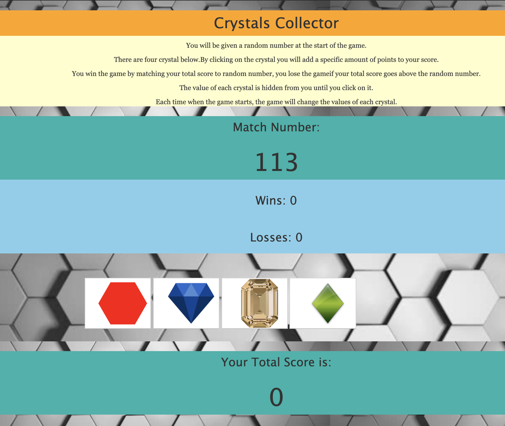

<h1>unit-4-game</h1>

Link:<a href="https://pracharya2601.github.io/unit-4-game/" target="_/blank">Deployed demo</a>

<h2> Built With </h2>
<ul>
    <li>HTML 5</li>
    <li>Bootstrap</li>
    <li>Javascript</li>
    <li>jQuery</li>
</ul>

<h3>Instruction</h3>
 
You will be given a random number at the start of the game.

There are four crystal below.By clicking on the crystal you will add a specific amount of points to your score.

You win the game by matching your total score to random number, you lose the gameif your total score goes above the random number.

The value of each crystal is hidden from you until you click on it.

Each time when the game starts, the game will change the values of each crystal.

 

